# Developer Guide: Web Search Integration

This document provides a comprehensive technical overview of how web search functionality is integrated into the Local LLM Chat MVP application.

## Table of Contents
- [Architecture Overview](#architecture-overview)
- [Tools and Technologies](#tools-and-technologies)
- [Search Result Gathering](#search-result-gathering)
- [LLM Integration](#llm-integration)
- [User Interface](#user-interface)
- [Data Flow](#data-flow)
- [Error Handling](#error-handling)
- [Future Enhancements](#future-enhancements)

## Architecture Overview

The web search integration follows a three-tier architecture:


## Tools and Technologies

### Backend Dependencies
- **FastAPI**: Web framework for API endpoints
- **httpx**: Async HTTP client for external API calls
- **BeautifulSoup4**: HTML parsing for web scraping fallback
- **requests**: HTTP client for search service

### Search Infrastructure
- **Primary**: DuckDuckGo Instant Answer API
- **Fallback**: DuckDuckGo HTML scraping with multiple selectors
- **LLM Integration**: Ollama (local LLM server)

### Frontend Components
- **React**: UI framework
- **styled-components**: CSS-in-JS styling
- **Streaming Response Handling**: Real-time result display

## Search Result Gathering

### Multi-Tiered Search Strategy

The search system implements a robust fallback mechanism:


### 1. Primary Search: DuckDuckGo Instant Answer API

**Endpoint**: `https://api.duckduckgo.com/`

**Implementation** (`backend/search_service.py:31-73`):
```python
async def search_duckduckgo(self, query: str, max_results: int = 5):
    encoded_query = quote_plus(query)
    url = f"https://api.duckduckgo.com/?q={encoded_query}&format=json&no_html=1&skip_disambig=1"
    
    # Handle instant answers and related topics
    if data.get("AbstractText"):
        results.append(SearchResult(...))
    
    for topic in data.get("RelatedTopics", []):
        results.append(SearchResult(...))
```

**Benefits**:
- Fast, structured responses
- High-quality instant answers
- Related topics for comprehensive coverage

### 2. Fallback: HTML Scraping

**Implementation** (`backend/search_service.py:75-148`):
```python
async def _fallback_web_search(self, query: str, max_results: int):
    urls_to_try = [
        f"https://html.duckduckgo.com/html/?q={encoded_query}",
        f"https://lite.duckduckgo.com/lite/?q={encoded_query}",
    ]
    
    selectors_to_try = [
        ('div.result', 'a.result__a', 'a.result__snippet'),
        ('div.web-result', 'h2 a', '.result__snippet'),
        ('tr', 'a.result-link', '.result-snippet'),  # Lite version
        # ... more selectors for robustness
    ]
```

**Robustness Features**:
- Multiple endpoint attempts
- Multiple CSS selector strategies
- URL cleaning for DuckDuckGo redirects
- Content length limits (titles: 200 chars, snippets: 300 chars)

### 3. Synthetic Fallback

When all search methods fail, the system provides helpful synthetic results:
```python
def _create_synthetic_results(self, query: str):
    return [
        SearchResult(
            title=f"Search for: {query}",
            url="https://duckduckgo.com/?q=" + quote_plus(query),
            snippet="I wasn't able to find web search results...",
            source="Fallback"
        )
    ]
```

## LLM Integration

### Search Result Processing Pipeline


### 1. Intelligent Result Filtering

**Implementation** (`backend/app.py:71-137`):
```python
async def filter_results_with_llm(query: str, results: list, max_results: int, model: str):
    ranking_prompt = f"""You are a search relevance expert. Given the user's query and a list of search results, identify the {max_results} most relevant results that best answer the user's question.

User's query: "{query}"

Search results:
{results_text}

Please respond with ONLY the numbers of the {max_results} most relevant results, separated by commas (e.g., "3,1,5").
```

**Benefits**:
- Semantic relevance over keyword matching
- Quality filtering from larger result sets
- Intelligent ranking based on user intent

### 2. Context Formation

The LLM receives structured context:
```python
search_context = "Based on the following search results:\n\n"
for i, result in enumerate(search_results, 1):
    search_context += f"{i}. {result['title']}\n"
    search_context += f"   URL: {result['url']}\n"
    search_context += f"   Summary: {result['snippet']}\n\n"
```

### 3. Response Synthesis

**Prompt Template** (`backend/app.py:179-185`):
```python
llm_prompt = f"""You are a helpful assistant with access to current web search results. Please provide a conversational, natural answer to the user's question based on the search results provided.

User's question: {query}

{search_context}

Please provide a direct, helpful answer based on this information. If the search results don't contain enough information to fully answer the question, acknowledge this and provide what information you can. Be conversational and natural in your response."""
```

## User Interface

### Search Activation

Users can trigger search in two ways:
1. **Dedicated Search Button**: Yellow "🦆🦆→" button in the message input
2. **Slash Command**: Type `/search <query>` in regular chat

**Frontend Implementation** (`frontend/src/components/EnhancedChatContainer.jsx:246-250`):
```javascript
const searchMatch = text.match(/^\/search\s+(.+)$/i)
if (searchMatch) {
  const query = searchMatch[1].trim()
  return searchMessage(query)
}
```

### Search Results Display

The UI shows search results in a dedicated component with:

```mermaid
graph TD
    A[Search Query Submitted] --> B[Show 🔍 Icon with Query]
    B --> C[Display Search Results Card]
    C --> D[Show Thinking Bubble]
    D --> E[Stream LLM Response]
    
    subgraph "Search Results Card"
        F[Query Header with Count]
        G[Individual Result Items]
        H[Title + URL + Snippet + Source]
    end
```



**Component Structure** (`frontend/src/components/SearchResults.jsx`):
- **SearchContainer**: Dashed border container
- **SearchHeader**: Query display with result count
- **ResultsList**: Individual result cards
- **ResultItem**: Title, URL, snippet, and source

### Visual Design

```css
/* Search results have distinctive styling */
border: 2px dashed #f5f5f5;  /* Dashed border to differentiate */
border-left: 3px solid #b8860b;  /* Gold accent on result items */

/* Interactive elements */
&:hover {
  background: rgba(255, 255, 255, 0.08);
  border-left-color: #daa520;
}
```

## Data Flow

### Complete Request/Response Cycle


### Message Flow in Frontend

**Search Message Processing** (`frontend/src/components/EnhancedChatContainer.jsx:126-240`):
```javascript
// 1. Add user message with search icon
addMessage('user', `🔍 ${text}`)

// 2. Stream response and parse different message types
if (data.search_results) {
  addMessage('search', JSON.stringify({
    query: data.query,
    results: data.search_results,
    count: data.search_results.length
  }))
}

// 3. Handle thinking content
if (content.includes('<think>')) {
  isInThinking = true
  setThinkingContent(currentThinking)
}

// 4. Add final assistant response
addMessage('assistant', finalMessage)
```

### Message Types

The system handles multiple message types:
- **'user'**: Regular user messages and search queries (with 🔍 prefix)
- **'search'**: Search results display (JSON data)
- **'assistant'**: LLM responses and synthesis
- **'error'**: Error messages

## Error Handling

### Graceful Degradation Strategy


### Error Recovery

**Backend Error Handling**:
```python
try:
    results = await self.search_duckduckgo(query, max_results)
except Exception as e:
    logger.error(f"DuckDuckGo search error: {e}")
    return await self._fallback_web_search(query, max_results)
```

**Frontend Error Handling**:
```javascript
catch (error) {
  clearTimeout(thinkingDelay)
  addMessage('error', error.message)
  setIsLoading(false)
}
```

### User Experience During Failures

1. **Transparent Communication**: Show search attempt with query
2. **Helpful Alternatives**: Suggest direct DuckDuckGo search
3. **Graceful Fallback**: Provide synthetic results with guidance
4. **No Broken State**: Always return a usable response

## Thinking Visualization System

The application implements a sophisticated real-time thinking visualization system that shows users the LLM's thought process as it streams responses.

### Architecture Overview


### Implementation Details

#### 1. Streaming Response Parsing

The system monitors the LLM's streaming response for special `<think>` tags that indicate internal reasoning:

**Tag Structure**:
```xml
<think>
The user is asking about X, so I need to consider Y and Z factors...
</think>
Here's my final response to the user.
```

**Parser Logic** (`frontend/src/components/EnhancedChatContainer.jsx:186-203`):
```javascript
let isInThinking = false
let currentThinking = ''
let finalMessage = ''

// Parse each streaming chunk
if (content.includes('<think>')) {
  isInThinking = true
  currentThinking = content.split('<think>')[1] || ''
}
else if (content.includes('</think>')) {
  isInThinking = false
  currentThinking += content.split('</think>')[0] || ''
  setThinkingContent(currentThinking)  // Show complete thought
  currentThinking = ''
}
else if (isInThinking) {
  currentThinking += content
  setThinkingContent(currentThinking)  // Update thinking in real-time
}
else if (!isInThinking && !content.includes('<think>')) {
  finalMessage += content  // Build final response
}
```

#### 2. State Management

The thinking system manages multiple UI states:

**State Variables**:
```javascript
const [thinkingContent, setThinkingContent] = useState('')  // Current thinking text
const [showThinking, setShowThinking] = useState(false)     // Whether to show thinking UI
const [isLoading, setIsLoading] = useState(false)          // Overall loading state
```

**State Transitions**:


#### 3. Thinking Bubble Component

The `ThinkingBubble` component provides visual feedback with two distinct modes:

**Mode 1: Loading State** (No thinking content yet):
```jsx
<ThinkingText>thinking</ThinkingText>
<ThinkingDots>
  <Dot>.</Dot>  {/* Animated dots with staggered delays */}
  <Dot>.</Dot>
  <Dot>.</Dot>
</ThinkingDots>
```

**Mode 2: Live Thinking Display** (Showing actual thought process):
```jsx
<ThinkingContentDiv>
  <ThinkingLabel>thinking:</ThinkingLabel>
  <ThinkingTextContent>{thinkingContent}</ThinkingTextContent>
</ThinkingContentDiv>
```

**Visual Design Features**:
- **Dashed border**: Distinguishes thinking from final responses
- **Pulsing glow animation**: Indicates active processing
- **Monospace font**: Makes thinking content feel like "code/debug" output
- **Real-time updates**: Text appears character by character as it streams

#### 4. Timing and User Experience

**Delayed Appearance**:
```javascript
const thinkingDelay = setTimeout(() => {
  setShowThinking(true)
}, 800)  // 800ms delay prevents flashing for quick responses
```

**Benefits**:
- **Prevents UI flicker** for fast responses
- **Builds anticipation** for complex queries
- **Provides feedback** that processing is happening

#### 5. Complete Thinking Flow


### Integration with Search

The thinking system works seamlessly with web search functionality:

**Search Thinking Example**:
```xml
<think>
The user is asking about current events, so I need to search for recent information.
Let me look at the search results:
1. Result A seems most relevant because...
2. Result B provides additional context about...
I'll synthesize this information into a comprehensive answer.
</think>
Based on recent search results, here's what's happening...
```

### Error Handling

**Cleanup on Errors**:
```javascript
catch (error) {
  clearTimeout(thinkingDelay)       // Cancel delayed thinking show
  setThinkingContent('')            // Clear any partial thinking
  setShowThinking(false)            // Hide thinking UI
  setIsLoading(false)              // Reset loading state
  addMessage('error', error.message) // Show error message
}
```

### Technical Benefits

1. **Real-time Feedback**: Users see processing happening immediately
2. **Transparency**: Shows the AI's reasoning process
3. **Engagement**: Makes waiting for responses more interesting  
4. **Debugging**: Developers can see how the LLM approaches problems
5. **Trust Building**: Users understand how conclusions are reached

### CSS Animations

**Thinking Dots Animation**:
```css
@keyframes thinking {
  0%, 80%, 100% {
    opacity: 0.3;
    transform: scale(1);
  }
  40% {
    opacity: 1;
    transform: scale(1.2);
  }
}

/* Staggered delays for wave effect */
.dot:nth-child(1) { animation-delay: 0s; }
.dot:nth-child(2) { animation-delay: 0.2s; }
.dot:nth-child(3) { animation-delay: 0.4s; }
```

**Container Glow Animation**:
```css
@keyframes thinking-glow {
  0%, 100% { 
    border-color: #b8860b;
    box-shadow: 0 0 5px rgba(184, 134, 11, 0.3);
  }
  50% { 
    border-color: #daa520;
    box-shadow: 0 0 15px rgba(218, 165, 32, 0.5);
  }
}
```

This thinking visualization system creates a unique and engaging user experience that sets the application apart from typical chat interfaces by providing unprecedented transparency into the AI's reasoning process.

## RAG-Based Context Management System

### What is RAG and Why Use It?

**RAG (Retrieval-Augmented Generation)** is an AI architecture pattern that enhances language models by combining them with a retrieval system. Instead of relying solely on the model's training data, RAG dynamically retrieves relevant information from an external knowledge base to inform the generation process.

#### Traditional LLM Limitations


#### RAG Solution Benefits

1. **Extended Memory**: Maintains conversation history beyond token limits
2. **Semantic Search**: Retrieves relevant past context based on current query
3. **Context Preservation**: Important information survives across sessions
4. **Intelligent Condensation**: Compresses context while preserving key insights
5. **Multi-layered Memory**: Different types of information stored strategically

#### Why We Implemented RAG

Our chat application needed to solve several critical problems:

- **Token Limit Constraints**: Modern LLMs have context windows (4k-200k tokens) that fill up during long conversations
- **Context Loss**: Important decisions and facts get "forgotten" when context is truncated
- **Inefficient Context Usage**: Naive approaches waste tokens on irrelevant old messages
- **Poor Long-term Conversations**: Users expect the AI to remember previous discussions
- **No Knowledge Persistence**: Each conversation starts from scratch

### Our RAG Implementation

We built a sophisticated multi-layered RAG system that goes beyond simple document retrieval to create an intelligent conversation memory.

#### Architecture Overview


#### 1. Multi-Layered Memory Structure

**Session Memory Components** (`backend/context_manager.py:53-80`):
```python
@dataclass
class SessionMemory:
    # Profile Memory (persistent across sessions)
    profile: Dict[str, Any] = None
    
    # Project Memory (stable mid-term context)
    constraints_decisions: List[str] = None
    canonical_facts: Dict[str, str] = None
    entities: Dict[str, str] = None
    
    # Scratchpad (ephemeral short-term)
    current_topic: str = ""
    working_context: str = ""
    
    # Rolling Summary (living document)
    rolling_summary: str = ""
    summary_version: int = 0
```

**Memory Hierarchy**:


#### 2. Context Chunking Strategy

**Intelligent Chunking** (`backend/context_manager.py:179-217`):
```python
def create_context_chunks(self, messages: List[Message]) -> List[ContextChunk]:
    chunks = []
    i = 0
    while i < len(messages):
        chunk_messages = [messages[i]]
        chunk_content = f"{messages[i].role}: {messages[i].content}"
        
        # Look ahead for related messages (max 3 per chunk)
        j = i + 1
        while j < len(messages) and j < i + 3:
            next_msg = messages[j]
            if (self._messages_related(messages[i], next_msg) and 
                len(chunk_content) < 400):  # Keep chunks manageable
                chunk_messages.append(next_msg)
                chunk_content += f"\n{next_msg.role}: {next_msg.content}"
                j += 1
            else:
                break
        
        chunk_type = self._classify_chunk_type(chunk_content)
        # Create ContextChunk with metadata...
```

**Chunk Classification System**:
- **Decision chunks**: "decided", "let's use", "we'll go with", "agreed"
- **Constraint chunks**: "must", "should not", "requirement", "rule"  
- **Fact chunks**: "is defined as", "equals", "specification"
- **Exchange chunks**: General conversation turns

#### 3. Semantic Retrieval Engine

**Relevance Scoring** (`backend/context_manager.py:262-298`):
```python
def semantic_retrieval(self, query: str, max_chunks: int = 3) -> List[ContextChunk]:
    query_words = set(re.findall(r'\w+', query.lower()))
    scored_chunks = []
    
    for chunk in self.context_chunks:
        chunk_words = set(re.findall(r'\w+', chunk.content.lower()))
        
        # Calculate Jaccard similarity
        overlap = len(query_words.intersection(chunk_words))
        union = len(query_words.union(chunk_words))
        jaccard_similarity = overlap / max(union, 1)
        
        # Boost important chunk types
        type_boost = {
            'decision': 1.5, 'constraint': 1.4, 
            'fact': 1.3, 'exchange': 1.0
        }.get(chunk.chunk_type, 1.0)
        
        # Time decay (prefer newer chunks)
        age_hours = (time.time() - chunk.timestamp) / 3600
        time_factor = max(0.5, 1.0 - (age_hours / 48))
        
        final_score = jaccard_similarity * type_boost * time_factor
```

**RAG Retrieval Flow**:


#### 4. Context Building Pipeline

**Optimized Context Assembly** (`backend/context_manager.py:442-484`):
```python
def build_context_for_llm(self, current_query: str = "") -> List[Dict[str, str]]:
    context_messages = []
    
    # 1. System message with constraints & decisions
    if self.session_memory.constraints_decisions:
        constraints_text = "\n".join(self.session_memory.constraints_decisions)
        context_messages.append({
            "role": "system",
            "content": f"Context Constraints & Decisions:\n{constraints_text}"
        })
    
    # 2. Rolling summary (if exists)
    if self.session_memory.rolling_summary:
        context_messages.append({
            "role": "system", 
            "content": f"Previous conversation summary: {self.session_memory.rolling_summary}"
        })
    
    # 3. Retrieved relevant context (RAG)
    if current_query:
        relevant_chunks = self.semantic_retrieval(current_query, max_chunks=3)
        if relevant_chunks:
            retrieved_content = "\n\n".join([
                f"[Relevant context from {chunk.chunk_type}]: {chunk.content}" 
                for chunk in relevant_chunks
            ])
            context_messages.append({
                "role": "system",
                "content": f"Relevant previous context:\n{retrieved_content}"
            })
    
    # 4. Recent conversation turns (last 8 messages)
    recent_messages = self.messages[-self.recent_window_size:]
    for msg in recent_messages:
        context_messages.append({"role": msg.role, "content": msg.content})
    
    return context_messages
```

#### 5. Intelligent Condensation

**LLM-Powered Summarization** (`backend/context_manager.py:300-349`):
```python
async def condense_context(self, llm_function) -> Dict[str, Any]:
    if not self.needs_condensation():
        return {'action': 'no_condensation_needed'}
    
    original_tokens = self.estimate_context_tokens()['total']
    messages_to_summarize = self.messages[:-self.recent_window_size]
    
    # Strategy 1: Create/update rolling summary
    new_summary = await self._create_rolling_summary(messages_to_summarize, llm_function)
    self.session_memory.rolling_summary = new_summary
    
    # Strategy 2: Extract constraints and decisions
    await self._extract_constraints_decisions(messages_to_summarize, llm_function)
    
    # Strategy 3: Create context chunks for RAG
    new_chunks = self.create_context_chunks(messages_to_summarize)
    self.context_chunks.extend(new_chunks)
    
    # Strategy 4: Trim to recent messages only
    self.messages = self.messages[-self.recent_window_size:]
    
    # Strategy 5: Clean up old chunks (keep only last 20)
    if len(self.context_chunks) > 20:
        self.context_chunks = sorted(self.context_chunks, 
                                   key=lambda x: x.timestamp, reverse=True)[:20]
```

**Condensation Triggers**:
- **Token usage** ≥ 90% of available context
- **Message count** > 50 messages
- **Recent messages** > 70% of available tokens

### Dashboard Design for Context Insights

The context visualization dashboard provides real-time insights into the RAG system's operation, designed with both user transparency and developer debugging in mind.

#### Design Philosophy

**Progressive Disclosure**: Start minimal, expand on demand

```mermaid
graph LR
    A[Compact View] --> B[Detailed Dashboard]
    A --> C[Context: 15% ████░░░ ⚡ Condensing... Clear 🧠 Details]
    B --> D[Memory Lanes Grid]
    B --> E[Token Breakdown]
    B --> F[Action Controls]
```


#### 1. Compact Context Tracker

**Minimal Real-time Display** (`frontend/src/components/ContextVisualization.jsx:377-409`):
```jsx
<CompactContainer>
  <CompactLeft>
    <ContextLabel>Context:</ContextLabel>
    <ContextPercent $percentage={tokenPercentage}>
      {Math.round(tokenPercentage)}%
    </ContextPercent>
    <CompactTokenBar>
      <CompactTokenFill $percentage={tokenPercentage} $isProcessing={isCondensing}/>
    </CompactTokenBar>
    {isCondensing && <CondensingAlert>Condensing...</CondensingAlert>}
  </CompactLeft>
  
  <CompactRight>
    <CompactClearButton onClick={handleClearSession}>Clear</CompactClearButton>
    <ExpandButton onClick={() => setIsExpanded(true)}>🧠 Details</ExpandButton>
  </CompactRight>
</CompactContainer>
```

**Visual Design Elements**:
- **Color-coded progress**: Green (0-70%), Yellow (70-90%), Red (90%+)
- **Animated processing**: Pulsing gradient during condensation
- **Subtle positioning**: Under input area, non-intrusive
- **Quick actions**: Clear and expand buttons with subtle borders

#### 2. Memory Lanes Visualization

**Grid-based Memory Display**:
```jsx
<MemoryLanes>
  <MemoryLane $color="rgba(78, 205, 196, 0.6)">
    <LaneTitle>Summary</LaneTitle>
    <LaneContent>{sessionMemory.rolling_summary || 'No summary yet'}</LaneContent>
  </MemoryLane>

  <MemoryLane $color="rgba(255, 167, 38, 0.6)">
    <LaneTitle>Constraints</LaneTitle>
    <LaneContent>
      {sessionMemory.constraints_decisions?.slice(-3).map((item, i) => (
        <div key={i}>• {item}</div>
      ))}
    </LaneContent>
  </MemoryLane>

  <MemoryLane $color="rgba(187, 134, 252, 0.6)">
    <LaneTitle>Current Topic</LaneTitle>
    <LaneContent>{sessionMemory.current_topic || 'General conversation'}</LaneContent>
  </MemoryLane>

  <MemoryLane $color="rgba(255, 107, 107, 0.6)">
    <LaneTitle>Facts</LaneTitle>
    <LaneContent>
      {Object.entries(sessionMemory.canonical_facts).slice(-2).map(([key, value], i) => (
        <div key={i}><strong>{key}:</strong> {value}</div>
      ))}
    </LaneContent>
  </MemoryLane>
</MemoryLanes>
```

**Color-coded Memory Types**:
- **Teal**: Rolling summary (condensed conversation history)
- **Orange**: Constraints and decisions (important agreements)
- **Purple**: Current topic (conversation context)
- **Red**: Canonical facts (key-value knowledge)
- **White**: Configuration (system settings)

#### 3. Context Metrics Dashboard

**Real-time Statistics Grid**:
```jsx
<ContextMetrics>
  <Metric>
    <MetricValue $type={tokenPercentage >= 90 ? 'danger' : 'success'}>
      {Math.round(tokenPercentage)}%
    </MetricValue>
    <MetricLabel>Context Usage</MetricLabel>
  </Metric>
  
  <Metric>
    <MetricValue>{contextStats.total_messages || 0}</MetricValue>
    <MetricLabel>Messages</MetricLabel>
  </Metric>
  
  <Metric>
    <MetricValue>{contextStats.context_chunks || 0}</MetricValue>
    <MetricLabel>Memory Chunks</MetricLabel>
  </Metric>
  
  <Metric>
    <MetricValue>{contextStats.condensation_count || 0}</MetricValue>
    <MetricLabel>Condensations</MetricLabel>
  </Metric>
</ContextMetrics>
```

#### 4. Interactive Controls

**Context Management Actions**:
```jsx
<ActionButtons>
  <ActionButton onClick={handleForceCondensation} disabled={isLoading}>
    {isLoading ? 'Condensing...' : 'Force Condense'}
  </ActionButton>
  
  <ActionButton onClick={handleClearSession}>
    Clear Session
  </ActionButton>
  
  <ActionButton onClick={() => setIsExpanded(!isExpanded)}>
    {isExpanded ? 'Collapse' : 'Expand'} View
  </ActionButton>
</ActionButtons>
```

#### 5. Real-time Updates

**Live Data Synchronization**:
```javascript
useEffect(() => {
  if (isVisible) {
    fetchContextData()
    const interval = setInterval(fetchContextData, 5000) // Update every 5 seconds
    return () => clearInterval(interval)
  }
}, [sessionId, isVisible])

const fetchContextData = async () => {
  const [statsResponse, memoryResponse, configResponse] = await Promise.all([
    fetch(`/api/context/stats/${sessionId}`),
    fetch(`/api/context/memory/${sessionId}`),
    fetch(`/api/context/config`)
  ])
  // Update UI state...
}
```

#### User Experience Benefits

1. **Transparency**: Users see exactly how their context is being managed
2. **Control**: Force condensation or clear context when needed
3. **Awareness**: Visual feedback on context consumption and processing
4. **Trust**: Understanding of how the AI maintains conversation memory
5. **Debugging**: Developers can diagnose context management issues

#### Visual Design Principles

- **Subtle by Default**: Compact view doesn't interfere with conversation flow
- **Progressive Disclosure**: Detailed view available on demand
- **Color Semantics**: Consistent color coding across different memory types
- **Real-time Feedback**: Animations and updates show system activity
- **Accessible Actions**: Clear, labeled buttons for user control

This RAG implementation creates a sophisticated conversation memory system that maintains context across long discussions while providing users with unprecedented visibility into how their AI assistant manages and recalls information.

## API Endpoints

### `/search` - Main Search Endpoint

**Request**:
```json
{
  "query": "user search query",
  "model": "qwen3:latest",
  "max_results": 5
}
```

**Response**: Streaming JSON chunks containing:
1. Search results object
2. LLM response chunks
3. Completion indicator

**Implementation Details**:
- Doubles initial search results for LLM filtering
- Uses structured prompts for relevance ranking
- Streams response for real-time user feedback

### `/search-enhanced` - Alternative Endpoint

Simplified version for testing with direct synthesis.

## Future Enhancements

### Planned Improvements

1. **Search Result Caching**
   - Redis integration for frequently searched terms
   - TTL-based cache invalidation

2. **Multiple Search Providers**
   - Bing Search API integration
   - Google Custom Search fallback
   - Wikipedia API for factual queries

3. **Enhanced LLM Integration**
   - Citation tracking and source attribution
   - Fact verification against multiple sources
   - Query intent classification

4. **User Experience**
   - Search history and suggestions
   - Filter options (time, source, type)
   - Bookmarking and result saving

### Technical Debt

1. **Rate Limiting**: Implement request throttling for search endpoints
2. **Monitoring**: Add metrics for search success rates and response times
3. **Testing**: Unit tests for search service and result parsing
4. **Documentation**: OpenAPI/Swagger documentation for all endpoints

## Development Notes

### Local Development Setup

1. **Backend**: Ensure Ollama is running on `localhost:11434`
2. **Dependencies**: Install `beautifulsoup4` for HTML parsing
3. **Environment**: No API keys required (using free DuckDuckGo)
4. **Testing**: Use `/search-enhanced` endpoint for simplified testing

### Debugging

Enable debug logging in `search_service.py`:
```python
print(f"[DEBUG] Query: {query}, Model: {model}, Max: {max_results}")
```

Search operation logs show:
- Search method attempts
- Result extraction success/failure
- LLM ranking responses
- Final result counts

This integration provides a robust, user-friendly web search experience that seamlessly blends real-time information with local LLM capabilities.